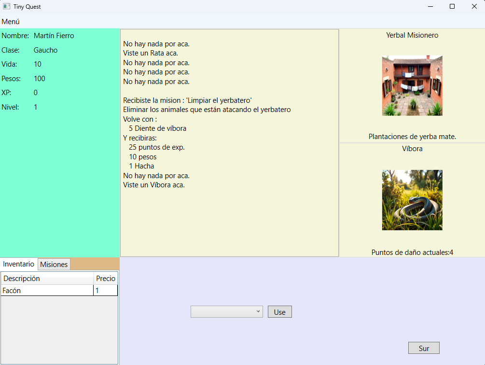
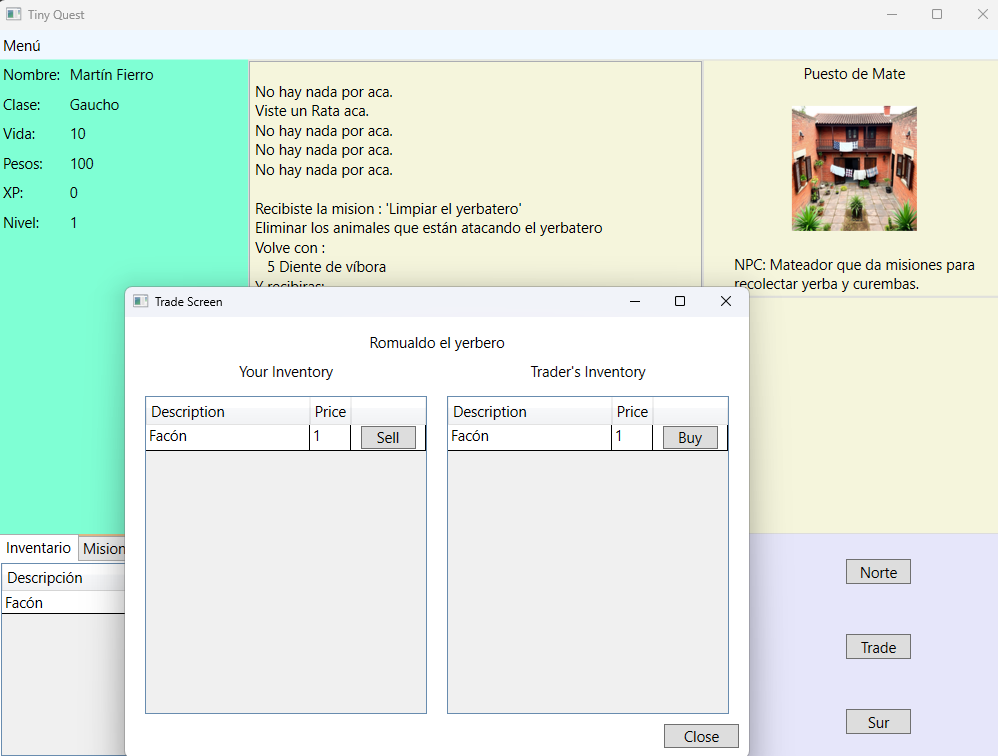

# RPG - Proyecto de Práctica en C# y WPF


---

Este proyecto es un **RPG básico** desarrollado en **C#** utilizando **WPF**.  
El objetivo principal es **practicar** conceptos fundamentales de desarrollo de software, trabajando sobre arquitectura y separación de responsabilidades de manera limpia.

> ⚡ Este proyecto no está orientado a ser un producto terminado, sino a consolidar habilidades técnicas a través de la práctica.

---

## Tecnologías utilizadas

- **C# (.NET 8)**
- **WPF (Windows Presentation Foundation)**
- **Arquitectura MVVM (Model-View-ViewModel)**

---

## Características actuales

- Creación y gestión de un personaje.
- Interfaz de usuario para visualizar la información del personaje.
- Navegación básica entre pantallas principales del juego.
- Base de estructura MVVM aplicada.

---

## Capturas de pantalla

### Pantalla principal


### Pantalla de trader


---

## Objetivos de aprendizaje

- Aplicar separación de responsabilidades siguiendo el patrón **MVVM**.
- Practicar el diseño y la interacción de **interfaces gráficas** en WPF.
- Fortalecer conceptos de **programación orientada a objetos** en C#.

---

## Estado del proyecto

> 🚧 **En desarrollo.**  
> El proyecto actualmente incluye las pantallas iniciales y la creación básica de personajes.  
> Se irá extendiendo progresivamente para incorporar mecánicas más complejas.

---

## Cómo correrlo

1. Clonar el repositorio:
   ```bash
   git clone https://github.com/Init0ne/TinyStudioRPG
   ```

2. Abrir la solución en **Visual Studio 2022** o superior.

3. Restaurar paquetes NuGet (si es necesario).

4. Compilar y ejecutar el proyecto.

---

## Contribución

Este proyecto es **de práctica personal**, por lo que **no se aceptan contribuciones externas**.  
Se agradece cualquier sugerencia o comentario para seguir mejorando.

---

## Limitaciones Actuales

Persistencia de datos: Actualmente, todo el progreso y estado del juego se mantiene en memoria durante la sesión. No existe guardado/carga desde una base de datos o archivos.

Estilo visual básico: El diseño de la interfaz gráfica es funcional pero minimalista, sin personalización estética avanzada.

Contenido limitado: El juego presenta una cantidad reducida de enemigos, ubicaciones y opciones de juego, suficiente para demostrar las mecánicas principales pero no una experiencia completa.

Balance de juego: El sistema de combate, progresión y recompensas no está completamente balanceado ni optimizado para una jugabilidad prolongada.

Sonido y animaciones: No se incluyen efectos de sonido, música, ni animaciones dentro del juego.

Falta de pruebas automatizadas: Actualmente no existen pruebas unitarias o de integración que respalden el funcionamiento del código.
